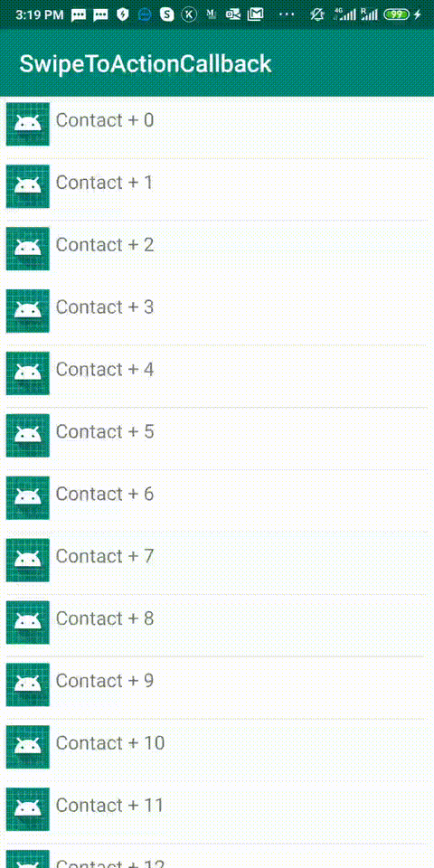

# Project Title

SwipeToActionCallback

## Description

This library allows you to implement "swipe to action" feature in your RecyclerView. This library
works with `RecyclerView`'s `ItemTouchHelper.SimpleCallback`, and draws icon and/or text under the icon.
The library allows you to have swipes from left, right or both sides at the same time. Look at the gif
that shows what can be achieved through this library:



## How it works

Have a look the app module to understand how it works. The installation is quite simple.
The main class is `SwipeToActionsCallback` which inherits `ItemTouchHelper.SimpleCallback`.
The class `SwipeToActionsCallback` needs two parameters which need to be passed:
1. `SwipeListener` implementation, through which you get notified about swipe actions.
2. The next parameter is `SwipeConfig`, which you decorate the left and/or 
right layouts when an item of RecyclerView swiped.

Then you should attach the ItemTouchHelper to your RecyclerView. Example:

```kotlin        
        val swipeActionCallback = SwipeToActionsCallback(
            DataUtils.defaultSwipeConfig(this), this
        )
        val itemTouchHelper = ItemTouchHelper(swipeActionCallback)
        itemTouchHelper.attachToRecyclerView(recyclerView)
```

## Config

The following is the description for the fields of `SwipeConfig`: 

- `swipeDirection` - enabled swipe direction, which might be `TO_LEFT`, 
`TO_RIGHT` or `TO_LEFT_RIGHT` (both) of `SwipeDirection`
- `leftIcon` - drawable icon, drawn on left, when swiped to right
- `rightIcon` - drawable icon, drawn on right, when swiped to left
- `leftActiveBackColor` - active background color of the layout,
 drawn on left, when swiped to right
- `rightActiveBackColor` - active background color of the layout,
 drawn on right, when swiped to left
- `disableBackColor` - inactive background color of the layout,
 drawn on right and/or left, when swiped to left and/or to right
- `textColor` - text color which is drawn under icon
- `textSizeSp` - text size in sp unit, which is drawn under icon 
- `leftText` - string text, drawn on left, when swiped to right
- `rightText` - string text, drawn on right, when swiped to left

## Installation

Step 1. Add the JitPack repository to your build file

Add it in your root build.gradle at the end of repositories:

	allprojects {
		repositories {
			...
			maven { url 'https://jitpack.io' }
		}
	}
	

Step 2. Add the dependency

	dependencies {
	        implementation 'com.github.Rhtyme:SwipeToActionCallback:1.0.0'
	}
